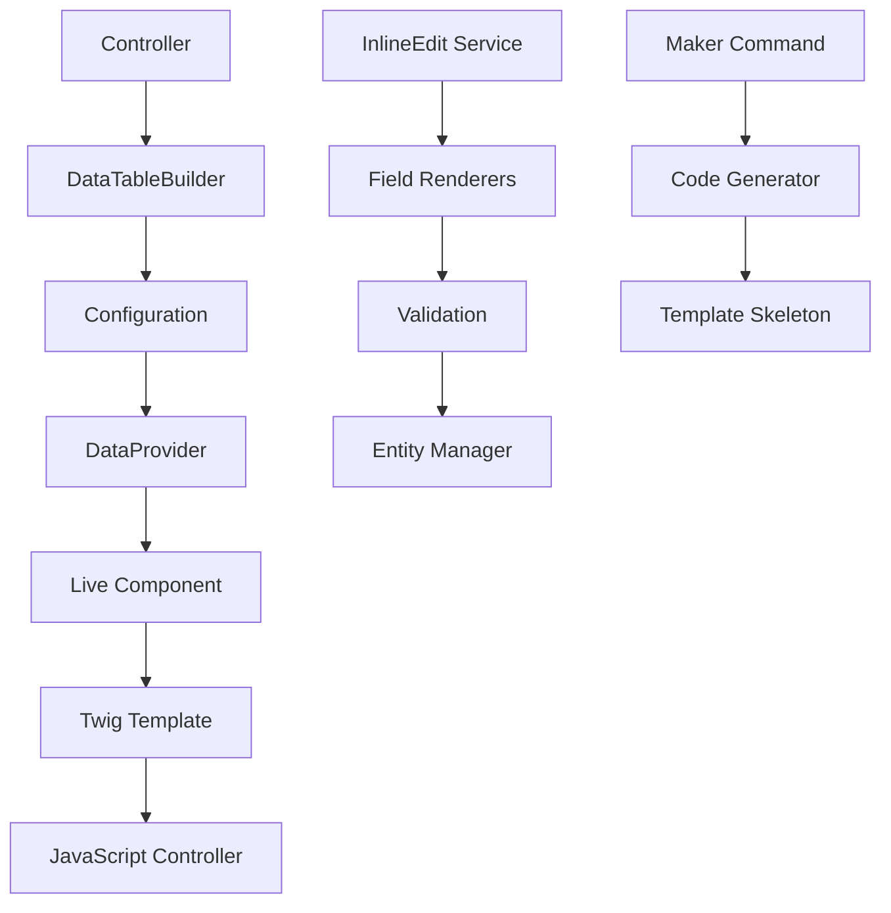

# Architecture du Bundle

Guide détaillé de l'architecture interne du SigmasoftDataTableBundle. 🏗️

## Vue d'ensemble

Le SigmasoftDataTableBundle utilise une architecture modulaire basée sur les principes SOLID et les design patterns modernes.



## Patterns Architecturaux

### 1. Builder Pattern

Le `DataTableBuilder` utilise le pattern Builder pour une configuration fluide :

```php
namespace Sigmasoft\DataTableBundle\Builder;

final class DataTableBuilder
{
    private DataTableConfiguration $configuration;
    
    public function createDataTable(string $entityClass): self
    {
        $this->configuration = new DataTableConfiguration($entityClass);
        return $this;
    }
    
    public function addColumn(ColumnInterface $column): self
    {
        $this->configuration->addColumn($column);
        return $this;
    }
    
    // Chaînage de méthodes pour configuration fluide
    public function setLabel(string $label): self
    {
        $this->configuration->setLabel($label);
        return $this;
    }
}
```

### 2. Factory Pattern

Les factories créent des objets complexes de manière cohérente :

```php
namespace Sigmasoft\DataTableBundle\Factory;

class EditableColumnFactory
{
    public function text(string $name, string $property, string $label): EditableColumnV2
    {
        return new EditableColumnV2(
            name: $name,
            property: $property,
            label: $label,
            type: 'text',
            renderer: $this->getRenderer('text')
        );
    }
    
    public function select(string $name, string $property, string $label, array $choices): EditableColumnV2
    {
        $column = new EditableColumnV2(
            name: $name,
            property: $property,
            label: $label,
            type: 'select',
            renderer: $this->getRenderer('select')
        );
        
        $column->setChoices($choices);
        return $column;
    }
}
```

### 3. Strategy Pattern

Les renderers utilisent le pattern Strategy pour un rendu flexible :

```php
namespace Sigmasoft\DataTableBundle\InlineEdit\Renderer;

interface FieldRendererInterface
{
    public function supports(EditableFieldConfiguration $config): bool;
    public function render(EditableFieldConfiguration $config, mixed $value, object $entity): string;
}

abstract class AbstractFieldRenderer implements FieldRendererInterface
{
    abstract public function supports(EditableFieldConfiguration $config): bool;
    
    protected function escapeHtml(string $value): string
    {
        return htmlspecialchars($value, ENT_QUOTES | ENT_HTML5, 'UTF-8');
    }
    
    protected function generateFieldId(object $entity, string $field): string
    {
        return sprintf('inline-edit-%s-%s', $entity->getId(), $field);
    }
}
```

### 4. Registry Pattern

Le `FieldRendererRegistry` centralise la gestion des renderers :

```php
namespace Sigmasoft\DataTableBundle\InlineEdit\Renderer;

class FieldRendererRegistry
{
    /** @var array<string, FieldRendererInterface> */
    private array $renderers = [];
    
    public function addRenderer(FieldRendererInterface $renderer): void
    {
        $this->renderers[] = $renderer;
    }
    
    public function getRenderer(EditableFieldConfiguration $config): FieldRendererInterface
    {
        foreach ($this->renderers as $renderer) {
            if ($renderer->supports($config)) {
                return $renderer;
            }
        }
        
        throw new \RuntimeException(sprintf(
            'No renderer found for field type "%s"',
            $config->getFieldType()
        ));
    }
}
```

## Architecture en Couches

### 1. Couche Présentation

**Live Components et Templates Twig**

```php
namespace Sigmasoft\DataTableBundle\Component;

#[AsLiveComponent('SigmasoftDataTable')]
class DataTableComponent
{
    use DefaultActionTrait;
    
    #[ExposeInTemplate]
    public string $entityClass;
    
    #[ExposeInTemplate]
    public array $configuration = [];
    
    #[LiveProp(writable: true)]
    public int $page = 1;
    
    #[LiveProp(writable: true)]
    public string $search = '';
    
    public function __invoke(): Response
    {
        return $this->render('@SigmasoftDataTable/components/DataTable.html.twig', [
            'data' => $this->loadData(),
            'config' => $this->configuration
        ]);
    }
}
```

### 2. Couche Service

**Services principaux et logique métier**

```php
namespace Sigmasoft\DataTableBundle\Service;

class InlineEditServiceV2
{
    public function __construct(
        private EntityManagerInterface $entityManager,
        private ValidatorInterface $validator,
        private FieldRendererRegistry $rendererRegistry,
        private LoggerInterface $logger
    ) {}
    
    public function updateField(
        object $entity,
        string $field,
        mixed $value,
        EditableFieldConfiguration $config
    ): InlineEditResult {
        // Début de transaction
        $this->entityManager->beginTransaction();
        
        try {
            // Validation
            $violations = $this->validateField($entity, $field, $value, $config);
            if (count($violations) > 0) {
                throw new ValidationException($violations);
            }
            
            // Mise à jour
            $this->propertyAccessor->setValue($entity, $field, $value);
            
            // Persistance
            $this->entityManager->persist($entity);
            $this->entityManager->flush();
            $this->entityManager->commit();
            
            return InlineEditResult::success($entity, $field, $value);
            
        } catch (\Exception $e) {
            $this->entityManager->rollback();
            $this->logger->error('Inline edit failed', [
                'entity' => get_class($entity),
                'field' => $field,
                'error' => $e->getMessage()
            ]);
            
            return InlineEditResult::error($e->getMessage());
        }
    }
}
```

### 3. Couche Données

**Data Providers et Repository Pattern**

```php
namespace Sigmasoft\DataTableBundle\DataProvider;

class DoctrineDataProvider implements DataProviderInterface
{
    public function __construct(
        private EntityManagerInterface $entityManager,
        private PaginatorInterface $paginator
    ) {}
    
    public function getData(
        string $entityClass,
        int $page = 1,
        int $limit = 25,
        ?string $search = null,
        ?string $sort = null,
        ?string $direction = 'asc'
    ): DataTableResultInterface {
        $repository = $this->entityManager->getRepository($entityClass);
        $queryBuilder = $repository->createQueryBuilder('e');
        
        // Recherche
        if ($search) {
            $this->applySearch($queryBuilder, $search, $entityClass);
        }
        
        // Tri
        if ($sort) {
            $queryBuilder->orderBy('e.' . $sort, $direction);
        }
        
        // Pagination
        $pagination = $this->paginator->paginate(
            $queryBuilder,
            $page,
            $limit
        );
        
        return new DataTableResult(
            items: $pagination->getItems(),
            totalItems: $pagination->getTotalItemCount(),
            itemsPerPage: $limit,
            currentPage: $page
        );
    }
}
```

## Configuration et Injection de Dépendances

### Configuration du Bundle

```php
namespace Sigmasoft\DataTableBundle\DependencyInjection;

class Configuration implements ConfigurationInterface
{
    public function getConfigTreeBuilder(): TreeBuilder
    {
        $treeBuilder = new TreeBuilder('sigmasoft_data_table');
        $rootNode = $treeBuilder->getRootNode();
        
        $rootNode
            ->children()
                ->arrayNode('defaults')
                    ->children()
                        ->integerNode('items_per_page')->defaultValue(25)->end()
                        ->booleanNode('enable_search')->defaultTrue()->end()
                        ->booleanNode('enable_sort')->defaultTrue()->end()
                        ->booleanNode('enable_pagination')->defaultTrue()->end()
                        ->scalarNode('table_class')->defaultValue('table table-striped')->end()
                        ->scalarNode('date_format')->defaultValue('d/m/Y H:i')->end()
                    ->end()
                ->end()
                ->arrayNode('entities')
                    ->useAttributeAsKey('class')
                    ->arrayPrototype()
                        ->children()
                            ->scalarNode('label')->isRequired()->end()
                            ->arrayNode('fields')
                                ->useAttributeAsKey('name')
                                ->arrayPrototype()
                                    ->children()
                                        ->scalarNode('type')->isRequired()->end()
                                        ->scalarNode('label')->isRequired()->end()
                                        ->booleanNode('sortable')->defaultTrue()->end()
                                        ->booleanNode('searchable')->defaultTrue()->end()
                                    ->end()
                                ->end()
                            ->end()
                        ->end()
                    ->end()
                ->end()
            ->end();
        
        return $treeBuilder;
    }
}
```

### Compiler Pass

```php
namespace Sigmasoft\DataTableBundle\DependencyInjection\Compiler;

class FieldRendererPass implements CompilerPassInterface
{
    public function process(ContainerBuilder $container): void
    {
        if (!$container->has(FieldRendererRegistry::class)) {
            return;
        }
        
        $registry = $container->findDefinition(FieldRendererRegistry::class);
        $taggedServices = $container->findTaggedServiceIds('sigmasoft.field_renderer');
        
        foreach ($taggedServices as $id => $tags) {
            $registry->addMethodCall('addRenderer', [new Reference($id)]);
        }
    }
}
```

## Sécurité et Validation

### Architecture de Sécurité

```php
namespace Sigmasoft\DataTableBundle\Security;

class DataTableVoter extends Voter
{
    public const VIEW = 'DATATABLE_VIEW';
    public const EDIT = 'DATATABLE_EDIT';
    public const DELETE = 'DATATABLE_DELETE';
    
    protected function supports(string $attribute, $subject): bool
    {
        return in_array($attribute, [self::VIEW, self::EDIT, self::DELETE])
            && $subject instanceof DataTableConfiguration;
    }
    
    protected function voteOnAttribute(string $attribute, $subject, TokenInterface $token): bool
    {
        $user = $token->getUser();
        
        if (!$user instanceof UserInterface) {
            return false;
        }
        
        return match($attribute) {
            self::VIEW => $this->canView($subject, $user),
            self::EDIT => $this->canEdit($subject, $user),
            self::DELETE => $this->canDelete($subject, $user),
            default => false
        };
    }
}
```

### Validation en Profondeur

```php
namespace Sigmasoft\DataTableBundle\Validation;

class FieldValidator
{
    public function __construct(
        private ValidatorInterface $validator,
        private PropertyAccessorInterface $propertyAccessor
    ) {}
    
    public function validateField(
        object $entity,
        string $field,
        mixed $value,
        array $constraints = []
    ): ConstraintViolationListInterface {
        // Validation des contraintes personnalisées
        if (!empty($constraints)) {
            return $this->validator->validate($value, $constraints);
        }
        
        // Validation via annotations/attributs de l'entité
        $metadata = $this->validator->getMetadataFor($entity);
        
        if ($metadata->hasPropertyMetadata($field)) {
            $propertyMetadata = $metadata->getPropertyMetadata($field);
            $constraints = [];
            
            foreach ($propertyMetadata as $member) {
                $constraints = array_merge($constraints, $member->getConstraints());
            }
            
            return $this->validator->validate($value, $constraints);
        }
        
        return new ConstraintViolationList();
    }
}
```

## Performance et Optimisation

### Stratégies de Cache

```php
namespace Sigmasoft\DataTableBundle\Cache;

class DataTableCache
{
    private CacheInterface $cache;
    
    public function getConfiguration(string $entityClass): ?DataTableConfiguration
    {
        $cacheKey = 'datatable_config_' . md5($entityClass);
        
        return $this->cache->get($cacheKey, function (ItemInterface $item) use ($entityClass) {
            $item->expiresAfter(3600); // 1 heure
            
            // Génération de la configuration
            return $this->configResolver->resolve($entityClass);
        });
    }
    
    public function invalidate(string $entityClass): void
    {
        $cacheKey = 'datatable_config_' . md5($entityClass);
        $this->cache->delete($cacheKey);
    }
}
```

### Optimisation des Requêtes

```php
namespace Sigmasoft\DataTableBundle\Query;

class QueryOptimizer
{
    public function optimizeQuery(QueryBuilder $queryBuilder, array $columns): void
    {
        // Sélection partielle pour performance
        $select = ['e.id'];
        foreach ($columns as $column) {
            if ($column->isVisible()) {
                $select[] = 'e.' . $column->getProperty();
            }
        }
        $queryBuilder->select($select);
        
        // Eager loading des relations
        $this->addEagerLoading($queryBuilder, $columns);
        
        // Index hints si supporté
        if ($this->supportsIndexHints()) {
            $this->addIndexHints($queryBuilder);
        }
    }
    
    private function addEagerLoading(QueryBuilder $queryBuilder, array $columns): void
    {
        foreach ($columns as $column) {
            if ($column instanceof RelationColumn) {
                $queryBuilder->leftJoin('e.' . $column->getRelation(), $column->getRelation())
                           ->addSelect($column->getRelation());
            }
        }
    }
}
```

## Tests et Qualité

### Structure des Tests

```
tests/
├── Unit/
│   ├── Builder/
│   │   └── DataTableBuilderTest.php
│   ├── Column/
│   │   └── EditableColumnTest.php
│   └── Service/
│       └── InlineEditServiceV2Test.php
├── Integration/
│   ├── Component/
│   │   └── DataTableComponentTest.php
│   └── DataProvider/
│       └── DoctrineDataProviderTest.php
└── Functional/
    ├── Controller/
    │   └── DataTableControllerTest.php
    └── Maker/
        └── MakeDataTableTest.php
```

### Tests Unitaires

```php
namespace Sigmasoft\DataTableBundle\Tests\Unit\Service;

class InlineEditServiceV2Test extends TestCase
{
    private InlineEditServiceV2 $service;
    private EntityManagerInterface $entityManager;
    private ValidatorInterface $validator;
    
    protected function setUp(): void
    {
        $this->entityManager = $this->createMock(EntityManagerInterface::class);
        $this->validator = $this->createMock(ValidatorInterface::class);
        
        $this->service = new InlineEditServiceV2(
            $this->entityManager,
            $this->validator,
            new FieldRendererRegistry(),
            new NullLogger()
        );
    }
    
    public function testUpdateFieldSuccess(): void
    {
        $entity = new User();
        $entity->setName('Old Name');
        
        $this->validator->expects($this->once())
            ->method('validate')
            ->willReturn(new ConstraintViolationList());
        
        $this->entityManager->expects($this->once())
            ->method('beginTransaction');
        
        $this->entityManager->expects($this->once())
            ->method('persist')
            ->with($entity);
        
        $this->entityManager->expects($this->once())
            ->method('flush');
        
        $this->entityManager->expects($this->once())
            ->method('commit');
        
        $config = new EditableFieldConfiguration('name', 'text');
        $result = $this->service->updateField($entity, 'name', 'New Name', $config);
        
        $this->assertTrue($result->isSuccess());
        $this->assertEquals('New Name', $entity->getName());
    }
}
```

## Extension et Personnalisation

### Créer un Renderer Personnalisé

```php
namespace App\DataTable\Renderer;

use Sigmasoft\DataTableBundle\InlineEdit\Renderer\AbstractFieldRenderer;
use Sigmasoft\DataTableBundle\InlineEdit\Configuration\EditableFieldConfiguration;

class RatingFieldRenderer extends AbstractFieldRenderer
{
    public function supports(EditableFieldConfiguration $config): bool
    {
        return $config->getFieldType() === 'rating';
    }
    
    protected function renderView(
        EditableFieldConfiguration $config,
        mixed $value,
        object $entity,
        array $options = []
    ): string {
        $rating = (int) $value;
        $maxRating = $options['max_rating'] ?? 5;
        
        $stars = str_repeat('★', $rating) . str_repeat('☆', $maxRating - $rating);
        
        return sprintf(
            '<span class="rating-field" data-rating="%d">%s</span>',
            $rating,
            $stars
        );
    }
    
    protected function renderEditForm(
        EditableFieldConfiguration $config,
        mixed $value,
        object $entity,
        array $options = []
    ): string {
        $maxRating = $options['max_rating'] ?? 5;
        $html = '<div class="rating-edit">';
        
        for ($i = 1; $i <= $maxRating; $i++) {
            $checked = $i <= $value ? 'checked' : '';
            $html .= sprintf(
                '<input type="radio" name="rating_%s" value="%d" %s>',
                $config->getFieldName(),
                $i,
                $checked
            );
        }
        
        $html .= '</div>';
        return $html;
    }
}
```

### Enregistrement du Renderer

```yaml
# config/services.yaml
services:
    App\DataTable\Renderer\RatingFieldRenderer:
        tags:
            - { name: sigmasoft.field_renderer }
```

## JavaScript et Frontend

### Architecture Stimulus

```javascript
// assets/controllers/datatable_controller.js
import { Controller } from '@hotwired/stimulus'
import { InlineEditManager } from '../services/InlineEditManager'

export default class extends Controller {
    static targets = ['table', 'search', 'pagination']
    static values = {
        url: String,
        entityClass: String
    }
    
    connect() {
        this.inlineEditManager = new InlineEditManager(this.element)
        this.initializeEventListeners()
    }
    
    initializeEventListeners() {
        // Recherche en temps réel
        this.searchTarget.addEventListener('input', 
            this.debounce(this.search.bind(this), 500)
        )
        
        // Édition inline
        this.element.addEventListener('inline-edit:start', this.onEditStart.bind(this))
        this.element.addEventListener('inline-edit:save', this.onEditSave.bind(this))
        this.element.addEventListener('inline-edit:cancel', this.onEditCancel.bind(this))
    }
    
    async search(event) {
        const query = event.target.value
        
        const response = await fetch(this.urlValue, {
            method: 'POST',
            headers: {
                'Content-Type': 'application/json',
                'X-Requested-With': 'XMLHttpRequest'
            },
            body: JSON.stringify({
                search: query,
                entity: this.entityClassValue
            })
        })
        
        if (response.ok) {
            const html = await response.text()
            this.updateTable(html)
        }
    }
    
    debounce(func, wait) {
        let timeout
        return function executedFunction(...args) {
            const later = () => {
                clearTimeout(timeout)
                func(...args)
            }
            clearTimeout(timeout)
            timeout = setTimeout(later, wait)
        }
    }
}
```

### Service d'Édition Inline

```javascript
// assets/services/InlineEditManager.js
export class InlineEditManager {
    constructor(element) {
        this.element = element
        this.editingFields = new Map()
        this.init()
    }
    
    init() {
        this.element.addEventListener('click', (e) => {
            if (e.target.closest('.inline-editable')) {
                this.startEdit(e.target.closest('.inline-editable'))
            }
        })
        
        // Raccourcis clavier
        document.addEventListener('keydown', (e) => {
            if (e.key === 'Escape') {
                this.cancelAllEdits()
            }
            if (e.key === 'Enter' && e.ctrlKey) {
                this.saveAllEdits()
            }
        })
    }
    
    startEdit(field) {
        const fieldId = field.dataset.fieldId
        const fieldType = field.dataset.fieldType
        
        if (this.editingFields.has(fieldId)) {
            return
        }
        
        const editor = this.createEditor(fieldType, field)
        this.editingFields.set(fieldId, {
            field,
            editor,
            originalValue: field.textContent
        })
        
        field.replaceWith(editor)
        editor.focus()
    }
    
    createEditor(type, field) {
        switch (type) {
            case 'text':
                return this.createTextEditor(field)
            case 'select':
                return this.createSelectEditor(field)
            case 'textarea':
                return this.createTextareaEditor(field)
            default:
                return this.createTextEditor(field)
        }
    }
    
    async save(fieldId) {
        const editData = this.editingFields.get(fieldId)
        if (!editData) return
        
        const { field, editor } = editData
        const newValue = editor.value
        
        try {
            const response = await fetch('/datatable/inline-edit', {
                method: 'POST',
                headers: {
                    'Content-Type': 'application/json',
                    'X-CSRF-Token': this.getCsrfToken()
                },
                body: JSON.stringify({
                    entity: field.dataset.entity,
                    id: field.dataset.entityId,
                    field: field.dataset.field,
                    value: newValue
                })
            })
            
            if (response.ok) {
                field.textContent = newValue
                editor.replaceWith(field)
                this.editingFields.delete(fieldId)
                this.showSuccess('Sauvegardé avec succès')
            } else {
                const error = await response.json()
                this.showError(error.message)
            }
        } catch (error) {
            this.showError('Erreur de connexion')
        }
    }
    
    getCsrfToken() {
        return document.querySelector('meta[name="csrf-token"]')?.content || ''
    }
}
```

---

## Support et Ressources

### Documentation Complète
- 📖 **API Reference** : [Documentation API](../api/overview)
- 🎨 **Personnalisation** : [Guide de customisation](../user-guide/customization)
- 🚀 **Exemples** : [Cas d'usage](../examples/basic-crud)

### Communauté et Support
- 🐛 **Issues GitHub** : [Signaler un problème](https://github.com/Chancel18/SigmasoftDataTableBundle/issues)
- 💬 **Discussions** : [Forum communautaire](https://github.com/Chancel18/SigmasoftDataTableBundle/discussions)
- 📧 **Support technique** : [support@sigmasoft-solution.com](mailto:support@sigmasoft-solution.com)

---

*Documentation technique rédigée par [Gédéon MAKELA](mailto:g.makela@sigmasoft-solution.com) - [Sigmasoft Solutions](https://sigmasoft-solution.com)*