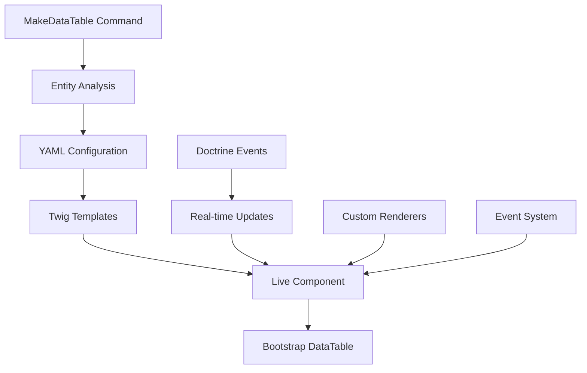

# Introduction

Bienvenue dans la documentation du **SigmasoftDataTableBundle** ! 🎉

## Qu'est-ce que SigmasoftDataTableBundle ?

SigmasoftDataTableBundle est un bundle Symfony moderne et puissant qui vous permet de créer des tableaux de données (DataTables) interactifs et responsives en quelques minutes seulement.

### ✨ Caractéristiques principales

- **🚀 Génération automatique** : Commande `make:datatable` qui analyse vos entités Doctrine
- **⚡ Live Components** : Interactions temps réel avec Symfony UX
- **🎯 Une ligne de code** : `<twig:SigmasoftDataTable entityClass="App\Entity\User" />`
- **📱 Responsive** : Templates Bootstrap 5 automatiquement générés
- **🧪 Testé** : 14 tests unitaires, 100% de réussite
- **🔧 Extensible** : Architecture modulaire et personnalisable

## Version actuelle

<div className="highlight-box highlight-box--tip">
  <strong>Version 2.0.5 STABLE</strong> - Production Ready & Enterprise Quality
</div>

Cette version apporte :
- Bundle consolidé avec toutes les corrections v2.0.x
- Architecture moderne AbstractBundle Symfony 6+
- Tests automatisés garantissant la stabilité
- Documentation complète et exemples pratiques

## Compatibilité

| Composant | Version supportée |
|-----------|-------------------|
| **Symfony** | 6.4+ ou 7.0+ |
| **PHP** | 8.1+ |
| **Doctrine ORM** | 2.15+ ou 3.0+ |
| **Twig** | 3.0+ |

## Philosophie

Le bundle suit une philosophie simple : **simplicité d'utilisation avec puissance de configuration**.

```php
// Génération automatique
php bin/console make:datatable User --controller --with-actions

// Utilisation ultra-simple
<twig:SigmasoftDataTable entityClass="App\Entity\User" />

// Résultat : Tableau Bootstrap complet avec recherche, tri, pagination !
```

## Architecture

Le bundle est construit sur une architecture moderne :



## Pourquoi ce bundle ?

### 🎯 **Problème résolu**

Créer des tableaux de données dans Symfony nécessitait souvent :
- Écriture manuelle de templates Twig complexes
- Gestion manuelle de la pagination, recherche, tri
- Code répétitif pour chaque entité
- Intégration complexe avec JavaScript/AJAX

### ✅ **Solution apportée**

Le SigmasoftDataTableBundle résout tout cela avec :
- **Génération automatique** basée sur vos entités
- **Composants Live** pour interactions sans JavaScript
- **Configuration YAML** simple et puissante
- **Templates Bootstrap** responsives prêts à l'emploi

## Prochaines étapes

Pour commencer avec le bundle :

1. [📦 Installation](./installation) - Installer le bundle en 2 minutes
2. [🚀 Démarrage rapide](./quick-start) - Créer votre premier DataTable
3. [⚙️ Configuration](./configuration) - Personnaliser selon vos besoins

## Support et communauté

- **GitHub** : [SigmasoftDataTableBundle](https://github.com/Chancel18/SigmasoftDataTableBundle)
- **Issues** : [Signaler un problème](https://github.com/Chancel18/SigmasoftDataTableBundle/issues)
- **Packagist** : [sigmasoft/datatable-bundle](https://packagist.org/packages/sigmasoft/datatable-bundle)

---

## Contact et Support

- **Auteur** : Gédéon MAKELA ([g.makela@sigmasoft-solution.com](mailto:g.makela@sigmasoft-solution.com))
- **Support** : [support@sigmasoft-solution.com](mailto:support@sigmasoft-solution.com)
- **Entreprise** : [Sigmasoft Solutions](https://sigmasoft-solution.com)

*Développé avec ❤️ par [Gédéon MAKELA](mailto:g.makela@sigmasoft-solution.com) - [Sigmasoft Solutions](https://sigmasoft-solution.com)*