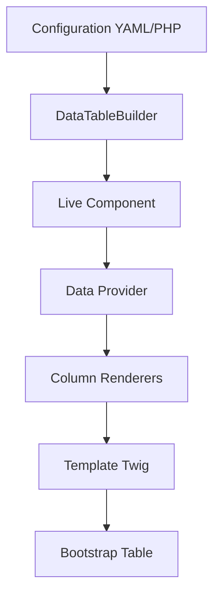

# Utilisation de Base

Guide complet pour utiliser le SigmasoftDataTableBundle dans vos applications Symfony. 📚

## Concepts Fondamentaux

### Architecture du Bundle

Le SigmasoftDataTableBundle utilise une architecture modulaire basée sur :

- **DataTableBuilder** : API fluide pour configurer vos tables
- **Live Components** : Interactions temps réel côté client
- **Column Types** : Types de colonnes prédéfinis et extensibles
- **Data Providers** : Sources de données (Doctrine, API, etc.)

### Cycle de Vie d'un DataTable



## Configuration de Base

### Configuration YAML

La configuration peut être définie dans `config/packages/sigmasoft_data_table.yaml` :

```yaml title="config/packages/sigmasoft_data_table.yaml"
sigmasoft_data_table:
    # Configuration globale
    defaults:
        items_per_page: 25
        enable_search: true
        enable_sort: true
        enable_pagination: true
        table_class: 'table table-striped table-hover'
        date_format: 'd/m/Y H:i'
        locale: 'fr'
    
    # Configuration par entité
    entities:
        'App\Entity\User':
            label: 'Gestion des Utilisateurs'
            description: 'Table des utilisateurs avec gestion des rôles'
            items_per_page: 20
            enable_export: true
            export_formats: ['csv', 'excel']
            
            # Configuration des champs
            fields:
                id:
                    type: integer
                    label: 'ID'
                    sortable: true
                    searchable: false
                    visible: true
                    width: '80px'
                    cssClass: 'text-center fw-bold'
                
                name:
                    type: string
                    label: 'Nom Complet'
                    sortable: true
                    searchable: true
                    required: true
                    maxLength: 255
                    placeholder: 'Entrez le nom complet'
                
                email:
                    type: email
                    label: 'Adresse Email'
                    sortable: true
                    searchable: true
                    unique: true
                    validation:
                        - Email: ~
                        - NotBlank: ~
                
                roles:
                    type: array
                    label: 'Rôles'
                    sortable: false
                    searchable: false
                    transform: 'json_encode'
                    renderer: 'badge_list'
                
                isActive:
                    type: boolean
                    label: 'Actif'
                    sortable: true
                    searchable: false
                    renderer: 'status_badge'
                
                createdAt:
                    type: datetime
                    label: 'Créé le'
                    sortable: true
                    searchable: false
                    format: 'd/m/Y H:i'
                    timezone: 'Europe/Paris'
                
                # Relations
                profile:
                    type: relation
                    label: 'Profil'
                    relation:
                        entity: 'App\Entity\Profile'
                        field: 'name'
                        route: 'profile_show'
                        route_params: ['id']
            
            # Actions personnalisées
            actions:
                view:
                    label: 'Voir'
                    icon: 'fas fa-eye'
                    route: 'user_show'
                    variant: 'info'
                    size: 'sm'
                edit:
                    label: 'Modifier'
                    icon: 'fas fa-edit'
                    route: 'user_edit'
                    variant: 'warning'
                    size: 'sm'
                delete:
                    label: 'Supprimer'
                    icon: 'fas fa-trash'
                    route: 'user_delete'
                    variant: 'danger'
                    size: 'sm'
                    confirm: true
                    confirmMessage: 'Êtes-vous sûr de vouloir supprimer cet utilisateur ?'
            
            # Filtres avancés
            filters:
                status:
                    type: select
                    label: 'Statut'
                    choices:
                        active: 'Actif'
                        inactive: 'Inactif'
                        pending: 'En attente'
                role:
                    type: choice
                    label: 'Rôle'
                    choices: '@App\Service\RoleProvider::getRoles'
                    multiple: true
                date_range:
                    type: date_range
                    label: 'Période de création'
                    fields: ['createdAt']
```

### Configuration PHP

Pour une configuration plus dynamique, utilisez le configurateur PHP :

```php title="config/datatable/UserDataTableConfig.php"
<?php

declare(strict_types=1);

namespace App\Config\DataTable;

use App\Entity\User;
use Sigmasoft\DataTableBundle\Configuration\AbstractDataTableConfiguration;
use Sigmasoft\DataTableBundle\Configuration\DataTableConfiguration;

class UserDataTableConfig extends AbstractDataTableConfiguration
{
    public function configure(DataTableConfiguration $config): void
    {
        $config
            ->setEntityClass(User::class)
            ->setLabel('Gestion des Utilisateurs')
            ->setItemsPerPage(25)
            ->setEnableSearch(true)
            ->setEnableSort(true)
            ->setEnablePagination(true)
            ->setTableClass('table table-striped table-hover')
            
            // Configuration des champs
            ->addField('id', [
                'type' => 'integer',
                'label' => 'ID',
                'sortable' => true,
                'searchable' => false,
                'width' => '80px',
                'css_class' => 'text-center fw-bold'
            ])
            
            ->addField('name', [
                'type' => 'string',
                'label' => 'Nom Complet',
                'sortable' => true,
                'searchable' => true,
                'required' => true,
                'max_length' => 255
            ])
            
            ->addField('email', [
                'type' => 'email',
                'label' => 'Email',
                'sortable' => true,
                'searchable' => true,
                'unique' => true
            ])
            
            ->addField('isActive', [
                'type' => 'boolean',
                'label' => 'Actif',
                'renderer' => 'status_badge'
            ])
            
            ->addField('createdAt', [
                'type' => 'datetime',
                'label' => 'Créé le',
                'format' => 'd/m/Y H:i'
            ])
            
            // Actions
            ->addAction('view', [
                'label' => 'Voir',
                'icon' => 'fas fa-eye',
                'route' => 'user_show',
                'variant' => 'info'
            ])
            
            ->addAction('edit', [
                'label' => 'Modifier',
                'icon' => 'fas fa-edit',
                'route' => 'user_edit',
                'variant' => 'warning'
            ])
            
            ->addAction('delete', [
                'label' => 'Supprimer',
                'icon' => 'fas fa-trash',
                'route' => 'user_delete',
                'variant' => 'danger',
                'confirm' => true,
                'confirm_message' => 'Êtes-vous sûr ?'
            ]);
    }
}
```

## Utilisation dans les Contrôleurs

### Méthode Simple avec Composant Twig

```php title="src/Controller/UserController.php"
<?php

declare(strict_types=1);

namespace App\Controller;

use App\Entity\User;
use Symfony\Bundle\FrameworkBundle\Controller\AbstractController;
use Symfony\Component\HttpFoundation\Response;
use Symfony\Component\Routing\Annotation\Route;

#[Route('/admin/users')]
class UserController extends AbstractController
{
    #[Route('', name: 'user_index', methods: ['GET'])]
    public function index(): Response
    {
        return $this->render('admin/user/index.html.twig');
    }
}
```

```twig title="templates/admin/user/index.html.twig"


Gestion des Utilisateurs


    <div class="container-fluid">
        <div class="row">
            <div class="col-12">
                <div class="d-flex justify-content-between align-items-center mb-4">
                    <h1 class="h3 mb-0">
                        <i class="fas fa-users me-2"></i>
                        Gestion des Utilisateurs
                    </h1>
                    
                    <div class="d-flex gap-2">
                        <a href="{{ path('user_new') }}" class="btn btn-primary">
                            <i class="fas fa-plus me-1"></i>
                            Nouvel Utilisateur
                        </a>
                    </div>
                </div>

                <div class="card shadow-sm">
                    <div class="card-body p-0">
                        {# 🚀 UNE SEULE LIGNE POUR UN DATATABLE COMPLET ! #}
                        <twig:SigmasoftDataTable entityClass="App\Entity\User" />
                    </div>
                </div>
            </div>
        </div>
    </div>

```

### Méthode Avancée avec DataTableBuilder

```php title="src/Controller/AdvancedUserController.php"
<?php

declare(strict_types=1);

namespace App\Controller;

use App\Entity\User;
use Sigmasoft\DataTableBundle\Builder\DataTableBuilder;
use Sigmasoft\DataTableBundle\Service\EditableColumnFactory;
use Symfony\Bundle\FrameworkBundle\Controller\AbstractController;
use Symfony\Component\HttpFoundation\Response;
use Symfony\Component\Routing\Annotation\Route;

#[Route('/admin/users-advanced')]
class AdvancedUserController extends AbstractController
{
    public function __construct(
        private readonly DataTableBuilder $dataTableBuilder,
        private readonly EditableColumnFactory $editableColumnFactory
    ) {}

    #[Route('', name: 'user_advanced_index', methods: ['GET'])]
    public function index(): Response
    {
        // Configuration programmatique avancée
        $dataTableConfig = $this->dataTableBuilder
            ->createDataTable(User::class)
            ->setLabel('Utilisateurs Avancés')
            ->setDescription('Gestion avancée avec édition inline')
            ->setItemsPerPage(20)
            ->enableSearch(['name', 'email'])
            ->enableSort()
            ->enablePagination()
            ->setTableClass('table table-striped table-hover table-sm')
            
            // Colonnes avec édition inline
            ->addColumn(
                $this->editableColumnFactory->text('name', 'name', 'Nom')
                    ->required(true)
                    ->maxLength(100)
                    ->placeholder('Nom complet')
                    ->cssClass('fw-bold')
            )
            
            ->addColumn(
                $this->editableColumnFactory->email('email', 'email', 'Email')
                    ->required(true)
                    ->unique(true)
                    ->placeholder('email@example.com')
            )
            
            ->addColumn(
                $this->editableColumnFactory->select('status', 'status', 'Statut', [
                    'active' => 'Actif',
                    'inactive' => 'Inactif',
                    'pending' => 'En attente',
                    'suspended' => 'Suspendu'
                ])
                ->required(true)
                ->defaultValue('active')
            )
            
            ->addColumn(
                $this->editableColumnFactory->textarea('notes', 'notes', 'Notes')
                    ->rows(3)
                    ->maxLength(500)
                    ->placeholder('Notes sur l\'utilisateur...')
            )
            
            ->addDateColumn('createdAt', 'createdAt', 'Créé le')
                ->format('d/m/Y H:i')
                ->sortable(true)
                ->searchable(false)
            
            // Actions personnalisées
            ->addActionColumn('actions', 'Actions')
                ->addAction('view', 'Voir', 'user_show', [
                    'icon' => 'fas fa-eye',
                    'variant' => 'info',
                    'size' => 'sm'
                ])
                ->addAction('edit', 'Modifier', 'user_edit', [
                    'icon' => 'fas fa-edit',
                    'variant' => 'warning',
                    'size' => 'sm'
                ])
                ->addAction('delete', 'Supprimer', 'user_delete', [
                    'icon' => 'fas fa-trash',
                    'variant' => 'danger',
                    'size' => 'sm',
                    'confirm' => true,
                    'confirm_message' => 'Supprimer cet utilisateur ?'
                ])
                
            // Export
            ->enableExport(['csv', 'excel'])
            ->setExportFileName('utilisateurs_' . date('Y-m-d'))
            
            // Personnalisation avancée
            ->setRowClass(function (User $user): string {
                return $user->isActive() ? '' : 'table-warning';
            })
            ->setRowAttributes(function (User $user): array {
                return [
                    'data-user-id' => $user->getId(),
                    'data-status' => $user->getStatus()
                ];
            });

        return $this->render('admin/user/advanced_index.html.twig', [
            'dataTableConfig' => $dataTableConfig,
            'stats' => [
                'total_users' => $this->getUserStats()['total'],
                'active_users' => $this->getUserStats()['active'],
                'inactive_users' => $this->getUserStats()['inactive']
            ]
        ]);
    }

    private function getUserStats(): array
    {
        // Implémentation des statistiques
        return [
            'total' => 150,
            'active' => 135,
            'inactive' => 15
        ];
    }
}
```

## Types de Colonnes Disponibles

### Colonnes de Base

```php
// Texte simple
->addTextColumn('name', 'name', 'Nom')

// Email avec validation
->addEmailColumn('email', 'email', 'Email')

// Date formatée
->addDateColumn('createdAt', 'createdAt', 'Créé le')
    ->format('d/m/Y H:i')

// Badge coloré
->addBadgeColumn('status', 'status', 'Statut', [
    'active' => ['label' => 'Actif', 'color' => 'success'],
    'inactive' => ['label' => 'Inactif', 'color' => 'danger']
])

// Actions
->addActionColumn('actions', 'Actions')
    ->addAction('edit', 'Modifier', 'user_edit')
```

### Colonnes Éditables

```php
// Texte éditable
$this->editableColumnFactory->text('name', 'name', 'Nom')
    ->required(true)
    ->maxLength(100)

// Select éditable
$this->editableColumnFactory->select('category', 'category', 'Catégorie', [
    'tech' => 'Technologie',
    'business' => 'Business',
    'design' => 'Design'
])

// Textarea éditable
$this->editableColumnFactory->textarea('description', 'description', 'Description')
    ->rows(4)
    ->maxLength(1000)

// Couleur éditable
$this->editableColumnFactory->color('color', 'color', 'Couleur')
    ->defaultValue('#007bff')
```

## Personnalisation Avancée

### Templates Personnalisés

Vous pouvez surcharger les templates par défaut :

```twig title="templates/bundles/SigmasoftDataTableBundle/components/DataTable.html.twig"
{# Template personnalisé pour le composant DataTable #}
<div {{ attributes.defaults({
    class: 'sigmasoft-datatable',
    'data-controller': 'datatable',
    'data-datatable-url-value': path('sigmasoft_datatable_data', { entityClass: entityClass })
}) }}>
    {# Barre de recherche personnalisée #}
    <div class="datatable-toolbar mb-3">
        <div class="row align-items-center">
            <div class="col-md-6">
                <div class="input-group">
                    <span class="input-group-text">
                        <i class="fas fa-search"></i>
                    </span>
                    <input type="search" 
                           class="form-control" 
                           placeholder="Rechercher..."
                           data-action="input->datatable#search"
                           data-datatable-target="searchInput">
                </div>
            </div>
            <div class="col-md-6 text-end">
                
                    <div class="btn-group" role="group">
                        <button type="button" class="btn btn-outline-secondary dropdown-toggle" 
                                data-bs-toggle="dropdown">
                            <i class="fas fa-download me-1"></i>
                            Exporter
                        </button>
                        <ul class="dropdown-menu">
                            <li><a class="dropdown-item" href="#" data-action="click->datatable#exportCsv">
                                <i class="fas fa-file-csv me-2"></i>CSV
                            </a></li>
                            <li><a class="dropdown-item" href="#" data-action="click->datatable#exportExcel">
                                <i class="fas fa-file-excel me-2"></i>Excel
                            </a></li>
                        </ul>
                    </div>
                
            </div>
        </div>
    </div>

    {# Table responsive #}
    <div class="table-responsive">
        <table class="{{ config.tableClass|default('table table-striped table-hover') }}">
            <thead class="table-dark">
                <tr>
                    
                        <th style="width: {{ column.width }}"
                            
                                class="sortable"
                                data-action="click->datatable#sort"
                                data-field="{{ column.field }}"
                            >
                            {{ column.label }}
                            
                                <i class="fas fa-sort ms-1"></i>
                            
                        </th>
                    
                </tr>
            </thead>
            <tbody data-datatable-target="tableBody">
                {# Contenu généré dynamiquement #}
            </tbody>
        </table>
    </div>

    {# Pagination personnalisée #}
    <div class="datatable-pagination mt-3">
        <div class="row align-items-center">
            <div class="col-md-6">
                <div class="datatable-info">
                    Affichage de <span data-datatable-target="startIndex">1</span> 
                    à <span data-datatable-target="endIndex">25</span> 
                    sur <span data-datatable-target="totalItems">100</span> éléments
                </div>
            </div>
            <div class="col-md-6">
                <nav data-datatable-target="pagination">
                    {# Pagination générée dynamiquement #}
                </nav>
            </div>
        </div>
    </div>

    {# Loading overlay #}
    <div class="datatable-loading d-none" data-datatable-target="loading">
        <div class="d-flex justify-content-center align-items-center h-100">
            <div class="spinner-border text-primary" role="status">
                <span class="visually-hidden">Chargement...</span>
            </div>
        </div>
    </div>
</div>
```

### Styles CSS Personnalisés

```css title="assets/styles/datatable.css"
/* Styles personnalisés pour SigmasoftDataTableBundle */

.sigmasoft-datatable {
    position: relative;
}

.sigmasoft-datatable .table th.sortable {
    cursor: pointer;
    user-select: none;
    transition: background-color 0.2s ease;
}

.sigmasoft-datatable .table th.sortable:hover {
    background-color: rgba(var(--bs-primary-rgb), 0.1);
}

.sigmasoft-datatable .table th.sortable.sorted-asc i::before {
    content: "\f0de"; /* fa-sort-up */
}

.sigmasoft-datatable .table th.sortable.sorted-desc i::before {
    content: "\f0dd"; /* fa-sort-down */
}

.datatable-loading {
    position: absolute;
    top: 0;
    left: 0;
    right: 0;
    bottom: 0;
    background: rgba(255, 255, 255, 0.8);
    z-index: 1000;
}

.inline-edit-field {
    border: 2px dashed transparent;
    padding: 4px 8px;
    border-radius: 4px;
    transition: all 0.2s ease;
}

.inline-edit-field:hover {
    border-color: var(--bs-primary);
    background-color: rgba(var(--bs-primary-rgb), 0.05);
    cursor: pointer;
}

.inline-edit-field.editing {
    border-color: var(--bs-warning);
    background-color: rgba(var(--bs-warning-rgb), 0.1);
}

.inline-edit-field.saving {
    border-color: var(--bs-info);
    background-color: rgba(var(--bs-info-rgb), 0.1);
}

.inline-edit-field.error {
    border-color: var(--bs-danger);
    background-color: rgba(var(--bs-danger-rgb), 0.1);
}

.inline-edit-field.success {
    border-color: var(--bs-success);
    background-color: rgba(var(--bs-success-rgb), 0.1);
}

/* Responsive enhancements */
@media (max-width: 768px) {
    .sigmasoft-datatable .table-responsive {
        font-size: 0.875rem;
    }
    
    .datatable-toolbar .row > div {
        margin-bottom: 1rem;
    }
    
    .datatable-toolbar .col-md-6:last-child {
        text-align: start !important;
    }
}
```

## Événements et Hooks

### Événements JavaScript

```javascript title="assets/controllers/datatable_controller.js"
import { Controller } from "@hotwired/stimulus"

export default class extends Controller {
    static targets = ["searchInput", "tableBody", "pagination", "loading"]
    static values = { url: String, entityClass: String }

    connect() {
        this.searchTimeout = null
        this.currentPage = 1
        this.currentSort = null
        this.currentSearch = ""
        
        // Charger les données initiales
        this.loadData()
        
        // Écouter les événements personnalisés
        this.element.addEventListener('datatable:beforeLoad', this.beforeLoad.bind(this))
        this.element.addEventListener('datatable:afterLoad', this.afterLoad.bind(this))
        this.element.addEventListener('datatable:error', this.onError.bind(this))
    }

    // Recherche avec debouncing
    search(event) {
        clearTimeout(this.searchTimeout)
        this.searchTimeout = setTimeout(() => {
            this.currentSearch = event.target.value
            this.currentPage = 1
            this.loadData()
        }, 500)
    }

    // Tri des colonnes
    sort(event) {
        const field = event.currentTarget.dataset.field
        const currentSort = this.currentSort
        
        if (currentSort && currentSort.field === field) {
            this.currentSort = {
                field: field,
                direction: currentSort.direction === 'asc' ? 'desc' : 'asc'
            }
        } else {
            this.currentSort = { field: field, direction: 'asc' }
        }
        
        this.updateSortIcons()
        this.loadData()
    }

    // Pagination
    changePage(event) {
        event.preventDefault()
        this.currentPage = parseInt(event.currentTarget.dataset.page)
        this.loadData()
    }

    // Export CSV
    exportCsv() {
        this.export('csv')
    }

    // Export Excel
    exportExcel() {
        this.export('excel')
    }

    // Méthodes privées
    async loadData() {
        this.dispatch('beforeLoad')
        this.showLoading()

        try {
            const params = new URLSearchParams({
                page: this.currentPage,
                search: this.currentSearch,
                entity: this.entityClassValue
            })

            if (this.currentSort) {
                params.append('sort', this.currentSort.field)
                params.append('direction', this.currentSort.direction)
            }

            const response = await fetch(`${this.urlValue}?${params}`)
            const data = await response.json()

            this.updateTable(data.rows)
            this.updatePagination(data.pagination)
            this.updateInfo(data.pagination)
            
            this.dispatch('afterLoad', { detail: data })
        } catch (error) {
            console.error('Erreur lors du chargement des données:', error)
            this.dispatch('error', { detail: error })
        } finally {
            this.hideLoading()
        }
    }

    // Événements personnalisés
    beforeLoad(event) {
        console.log('Chargement des données en cours...')
    }

    afterLoad(event) {
        console.log('Données chargées:', event.detail)
        
        // Réinitialiser l'édition inline
        this.initInlineEdit()
    }

    onError(event) {
        console.error('Erreur DataTable:', event.detail)
        this.showError('Erreur lors du chargement des données')
    }

    // Helpers
    showLoading() {
        this.loadingTarget.classList.remove('d-none')
    }

    hideLoading() {
        this.loadingTarget.classList.add('d-none')
    }

    showError(message) {
        // Afficher un toast ou une alerte
        const alert = document.createElement('div')
        alert.className = 'alert alert-danger alert-dismissible fade show'
        alert.innerHTML = `
            ${message}
            <button type="button" class="btn-close" data-bs-dismiss="alert"></button>
        `
        this.element.prepend(alert)
    }
}
```

---

## Support et Assistance

### Documentation Complète
- 📖 **API Reference** : [Documentation API](../api/overview)
- 🔧 **Guide Développeur** : [Guide avancé](../developer-guide/architecture)
- 🚀 **Exemples** : [Cas d'usage](../examples/basic-crud)

### Communauté et Support
- 🐛 **Issues GitHub** : [Signaler un problème](https://github.com/Chancel18/SigmasoftDataTableBundle/issues)
- 💬 **Discussions** : [Forum communautaire](https://github.com/Chancel18/SigmasoftDataTableBundle/discussions)
- 📧 **Support technique** : [support@sigmasoft-solution.com](mailto:support@sigmasoft-solution.com)

---

*Documentation rédigée par [Gédéon MAKELA](mailto:g.makela@sigmasoft-solution.com) - [Sigmasoft Solutions](https://sigmasoft-solution.com)*